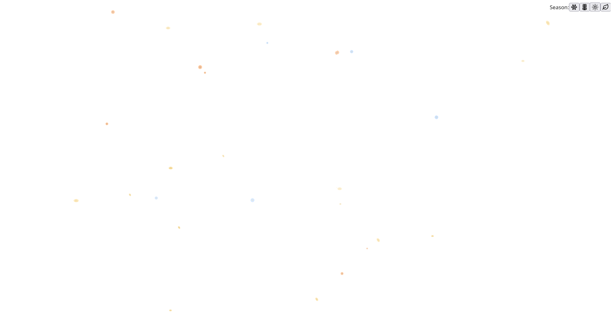
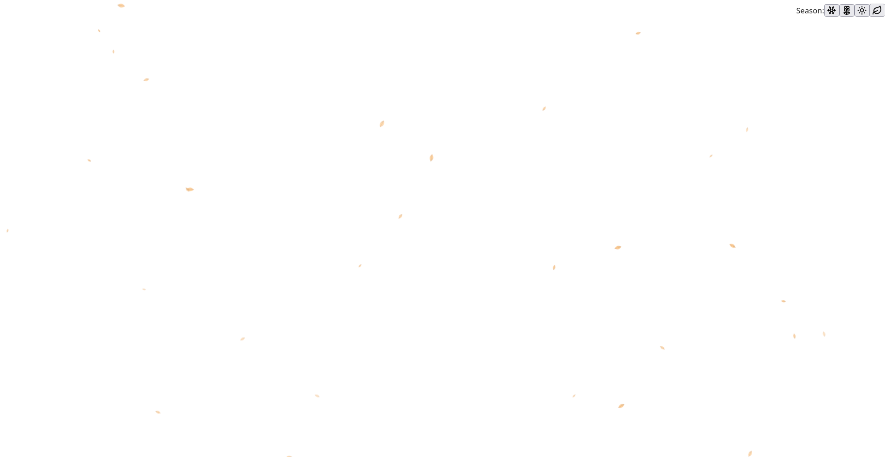

# Web Effects Collection

A collection of stunning visual effects and animated backgrounds built with modern web technologies. Each effect is a standalone project showcasing different animation techniques and interactive experiences.

## Preview

### Particle Background Effect


### Seasonal Background Effect
<table>
  <tr>
    <td width="50%">
      <b>Winter</b><br>
      
    </td>
    <td width="50%">
      <b>Spring</b><br>
      
    </td>
  </tr>
  <tr>
    <td width="50%">
      <b>Summer</b><br>
      
    </td>
    <td width="50%">
      <b>Autumn</b><br>
      
    </td>
  </tr>
</table>

## Projects

### Particle Background

Interactive 3D particle system with mouse-responsive animations. Built with React Three Fiber and Next.js.

**Features:**
* 3D particle interactions
* Mouse tracking
* Multiple effect versions
* Smooth performance

[View Project](./particle-background)

### Seasonal Background

Animated background with dynamic seasonal transitions and weather effects. Built with React and Vite.

**Features:**
* Seasonal theme transitions
* Dynamic weather effects
* Smooth animations
* Interactive controls

[View Project](./season-background)

## Getting Started

### Prerequisites

Before running any project, ensure you have Node.js installed on your system. You can download it from [nodejs.org](https://nodejs.org/).

For faster package installation and better performance, we recommend installing pnpm:

```bash
npm install -g pnpm
```

### Running a Project

Navigate to the project directory you want to run:

```bash
cd particle-background
```

or

```bash
cd season-background
```

Install dependencies:

```bash
pnpm install
```

Start the development server:

```bash
pnpm dev
```

## Tech Stack

* React 19
* TypeScript
* Tailwind CSS
* Next.js (Particle Background)
* Vite (Seasonal Background)
* Three.js / React Three Fiber (Particle Background)

## Project Structure

```
web-effects/
├── particle-background/    # 3D particle effect with Next.js
└── season-background/      # Seasonal theme transitions with Vite
```

## License

MIT
