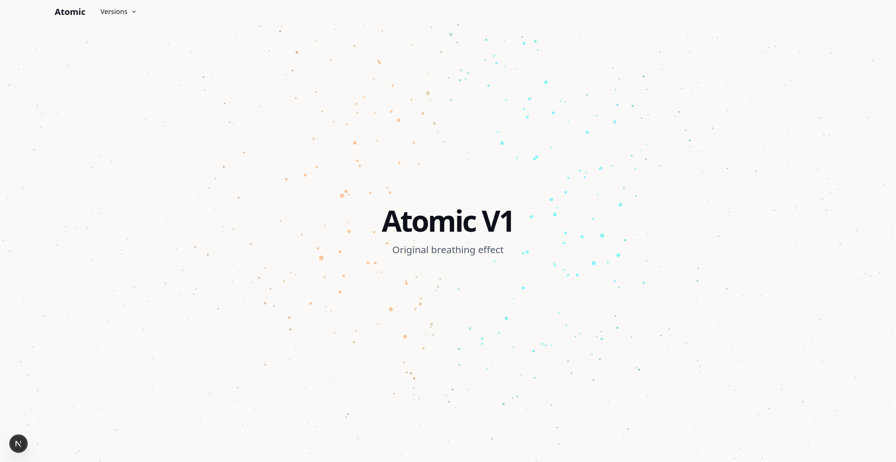
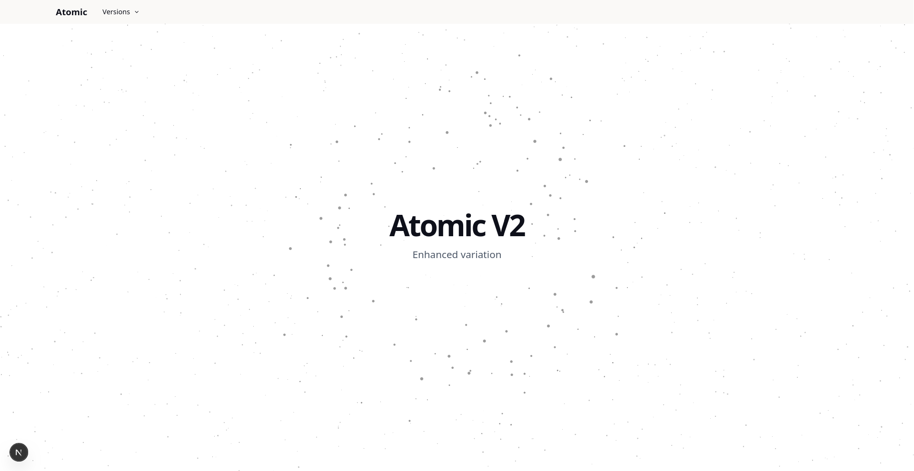

# Particle Background

A dynamic 3D particle background effect built with React Three Fiber and Next.js. Features interactive particles that respond to mouse movement and create an immersive visual experience.

## Preview

### Version 1


### Version 2


## Features

* Interactive 3D particle system
* Mouse-responsive animations
* Multiple effect versions (v1 & v2)
* Built with React Three Fiber for smooth performance
* Fully responsive design

## Tech Stack

* Next.js 16
* React 19
* Three.js
* React Three Fiber
* TypeScript
* Tailwind CSS

## Getting Started

### Prerequisites

Make sure you have Node.js installed on your system. For faster package installation, we recommend using pnpm.

```bash
npm install -g pnpm
```

### Installation

Install dependencies:

```bash
pnpm install
```

### Running the Application

Start the development server:

```bash
pnpm dev
```

Open [http://localhost:3000](http://localhost:3000) in your browser to see the effect.

## Project Structure

* `/app` - Next.js pages and routing
* `/components/features/particles` - Particle effect components
* `/components/ui` - UI components
* `/components/layouts` - Layout components

## Available Versions

* **v1** - Basic particle background with mouse interaction
* **v2** - Enhanced particle effects with additional animations

## License

MIT
